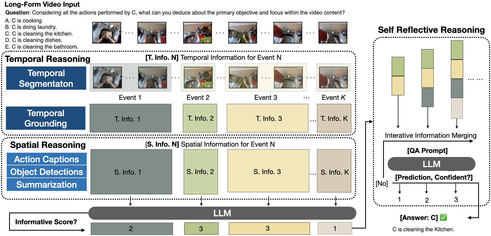

# VideoINSTA: Zero-shot Long-Form Video Understanding via Informative Spatial-Temporal Reasoning

This is the official implementation of the paper [VideoINSTA: Zero-shot Long-Form Video Understanding via Informative Spatial-Temporal Reasoning](https://arxiv.org/abs/2409.20365).



## 💡 Framework

### Configuration

The configuration of an experiment is done in a YAML file.
Since there are lots of parameters that can be configured, these will not be described in detail.

However, there are different existing configurations in the `config/` folder that can be used as a references.
Moreover, reading through the following sections will give a good overview of the whole framework with all its
configuration parameters.

### Entry Point

The entry point to the framework is the `run_experiment.py` script together with the `video_reasoning_experiment`
package.

The `run_experiment.py` script just calls the `video_reasoning_experiment.main` module.

The `video_reasoning_experiment.main` module is responsible for creating the necessary experiment environment.
This includes the setup of the experiment directories for saving the results, the reading of the experiment
configuration, the setup of the global logger and the creation of a specific experiment instance.

### Experiment

The classes for such an experiment instance are located in the `video_reasoning_experiment.experiment` module.
The default for using the VideoINSTA structure is the `VideoReasoningVideoINSTAExperiment` class.
Further classes for different experiment types could be added to this module.

The `VideoReasoningVideoINSTAExperiment` class is responsible for parsing the provided configuration, read all required files
from the dataset (e.g. tasks and videos), create the initial setup for the video reasoning process and iterate through
the provided video dataset.

The initial setup includes the following steps that are configured in the configuration file:

- the instantiation of the clip state class to use (e.g. `ClipStateWithoutConditionedSpatialState`)
- the instantiation of the operations to use (e.g. `DPCKNNSplit` as the split operation)
- the instantiation of the API with the parameters for its functions (see the `api.api` module)
- the instantiation of the initial VideoINSTA structure for each video (e.g. the root clip with its initial state)
- the instantiation of the VideoINSTA controller combining everything from above together for each video

### Video Reasoning

The orchestration of the VideoINSTA video reasoning process is implemented in `video_reasoning.controller`.
This can be thought of as the main handling point for the reasoning process.

#### Structure

The modelling of the VideoINSTA structure is implemented in `video_reasoning.structure.videoinsta`.
Other structures could be implemented in the package `video_reasoning.structure`.

#### State

The state of a clip represents a combination of a video clip, a temporal, a spatial and a universal state.
The clip simply represents a clip in the VideoINSTA structure, whereas the state represents the video reasoning state of the clip.
That reasoning state combines perceptual information with reasoning information.

The modelling of a clip state and its corresponding utilities are implemented in `video_reasoning.state`.

##### Video

The modelling of the video clip associated with a clip and its corresponding utilities are implemented in
`video_reasoning.state.video`. Note that such a video clip can also be a single frame or the whole video.

##### Clip

The clip state can be thought of as the fusion point of the video clip, the temporal state, the spatial state and the
universal state.
The modelling of that clip state and its corresponding utilities are implemented in `video_reasoning.state.clip`.

##### Spatial

The spatial state represents the spatial information of the clip, i.e. action captions and object detections.
The modelling of that spatial state and its corresponding utilities are implemented in `video_reasoning.state.spatial`.

##### Temporal

The temporal state represents the temporal information of the clip, i.e. the temporal grounding of the clip.
The modelling of that temporal state and its corresponding utilities are implemented
in `video_reasoning.state.temporal`.

##### Universal

The universal state represents the universal information of VideoINSTA, i.e. the summary of the action captions of the
whole video.
There should be only one universal state for the whole VideoINSTA structure, can be thought of as a singleton in the reasoning process.
The modelling of that universal state and its corresponding utilities are implemented
in `video_reasoning.state.universal`.

### API

The package `api` contains machine-learning-model-based functionalities combined with algorithmic tools that are used
during the video reasoning process. A cool name for that is "neural modules", where lots of "AI" is used. 😉

The module `api.api` contains a class `API` that provides different public functions.
For each function, this class has a configuration for the hyperparameters of the function.

The public functions use the interfaces of the machine-learning-models in the `toolbox` package.

Their usage is currently statically defined in the `derive` functions of the `video_reasoning.state.DerivableState`
child-classes, but this architecture opens the possibility to dynamically define the usage of the API functions.

### Toolbox

The package `toolbox` provides the different machine-learning-models that are used as tools in the "neural modules".
As you already know, these tools are composed in a reasonable way to solve higher level problems in the `api`.

The modules itself are only capable of solving low level problems like object detection in images, video clip captioning
or language completion, but together with the `api` they can solve higher level problems that occur during video
reasoning.

#### Visual Expert Tools

The sub-packages of `toolbox` are the different tools that are used on the "neural modules" of the `api`.
Some of them may contain machine-learning model implementations themselves, others may contain interfaces to libraries
or remote APIs, e.g. HuggingFace or OpenAI.

The specific tools are described in the following.

##### GroundingDINO

An open-world object detection model.
Please note that we did not use this model in our paper.
However, it can still be used for further experiments in the domain of video question answering.

- Sub-package: `toolbox.GroundingDINO`
- Interface module: `toolbox.GroundingDINO.object_detector_inference`
- Interface usage: `python -m toolbox.GroundingDINO.object_detector_inference` (adapt parameters in main call of the
  module)
- Original
  usage: `python demo/inference_on_a_image.py -c "groundingdino/config/GroundingDINO_SwinB_cfg.py" -p "weights/groundingdino_swinb_cogcoor.pth" -i "weights/10206.png" -o "./outputs" -t "the sink . the pan . the handle . the right hand"`
- Paper: https://arxiv.org/abs/2303.05499
- Short Overview: https://www.youtube.com/watch?v=wxWDt5UiwY8
- GitHub: https://github.com/IDEA-Research/GroundingDINO
- Pretrained Models: https://github.com/IDEA-Research/GroundingDINO/tree/main#luggage-checkpoints

##### LaViLa

A video captioning model.

- Sub-package: `toolbox.lavila_video_captioner`
- Interface module: `toolbox.lavila_video_captioner.narrator_inference`
- Interface usage: use one of the functions (straight forward)
- Original
  usage: `python demo_narrator.py --video-path "../ma-nlq-vid-temp-win-mirror/data/egoschema/001d2d1b-d2f9-4c39-810e-6e2087ff9d5a.mp4`
- Paper: https://arxiv.org/pdf/2212.04501.pdf
- GitHub: https://github.com/facebookresearch/LaViLa/tree/main
- Pretrained Models: https://github.com/facebookresearch/LaViLa/blob/main/docs/MODEL_ZOO.md#zero-shot

##### CogAgent

A visual language model.

- Integration via HuggingFace.
- Paper: https://arxiv.org/abs/2312.08914
- GitHub: https://github.com/THUDM/CogVLM
- Chat Model on HuggingFace: https://huggingface.co/THUDM/cogagent-chat-hf
- VQA Model on HuggingFace (we use this): https://huggingface.co/THUDM/cogagent-vqa-hf

##### UniVTG

A video temporal grounding model.

- Sub-package: `toolbox.UniVTG`
- Interface module: `toolbox.UniVTG.temporal_grounding_inference`
- Interface usage: `python -m toolbox.UniVTG.temporal_grounding_inference` (adapt parameters in main call of the module)
- Paper: https://arxiv.org/pdf/2307.16715.pdf
- GitHub: https://github.com/showlab/UniVTG
- HuggingFace: https://huggingface.co/spaces/KevinQHLin/UniVTG

#### LLMs

Large language models. 🦜 There are local and remote ones. Note that the local ones are integrated via the remote
HuggingFace model hub.

##### Local

- Sub-package: `toolbox.llm.local`
- Requirement: Huggingface API key in `.env` file
- Usage: `import toolbox.llm.local` and use the classes in the module (compare `test_llama.py` script).
- Supported models:
    - `meta-llama/Llama-2-13b-hf` (see https://huggingface.co/meta-llama/Llama-2-13b-hf)
    - `meta-llama/Llama-2-7b-hf` (see https://huggingface.co/meta-llama/Llama-2-7b-hf)
    - `meta-llama/Llama-2-70b-chat-hf` (see https://huggingface.co/meta-llama/Llama-2-70b-chat-hf)
    - `Meta-Llama-3-8B-Instruct` (see https://huggingface.co/meta-llama/Meta-Llama-3-8B-Instruct)
    - `google/gemma-7b-it` (see https://huggingface.co/google/gemma-7b-it)
- If you want to use other models, you can add either just use them or add special implementation (if required, please
  double-check!!!) to `toolbox.llm.local`
- Papers or Sources:
    - Llama2: https://arxiv.org/abs/2307.09288
    - Llama3: https://github.com/meta-llama/llama3/blob/main/MODEL_CARD.md
    - Gemma: https://arxiv.org/abs/2403.08295

##### Remote

- Sub-package: `toolbox.llm.remote`
- Requirement: OpenAI API key in `.env` file
- Usage: `import toolbox.llm.remote` and use the classes in the module (compare `test_chat_gpt.py` script).
- All ChatGPT models of the OpenAI API are supported.
- Overview of the models: https://platform.openai.com/docs/models
- Quickstart (in case you are not familiar): https://platform.openai.com/docs/quickstart

### Datasets

The package `datasets` provides the utilities for loading datasets that are used in our experiments.
New datasets can be added easily by adding a new case to the `load_data` function in the `datasets.load` module.
Please follow for the data representation of the new datasets as for the other current datasets.
If required, you can normalize the data (i.e. making the first char uppercase and assuring a question mark at the end of
the question).

## 🛠️ Setup

### Required System Dependencies

- Note that we use CUDA version 11.3 for all our experiments.
- If you are using local LLMs such as `meta-llama/Meta-Llama-3-8B-Instruct`, please make sure to use at least 40 GB of GPU memory.
- If you are using UniVTG, please make sure to use at least 25 GB of GPU memory.
- To use our framework efficiently in parallel, please make sure to use SLURM for job scheduling (or something similar).

### Required Datasets

Please download the following datasets and save them in your machines data mount directory, denoted as `/PATH/TO/DATA`.

- [EgoSchema](https://github.com/egoschema/EgoSchema): Follow their instructions to download the dataset. Note that there is exactly one task per video. Only the 500 videos appearing in `subset_answers.json` are required.
- [NExT-QA](https://github.com/doc-doc/NExT-QA): Follow their instructions to download the dataset. Note that there are multiple tasks per video. Only the 570 videos appearing in `val.csv` are required (which contains 4,969 tasks).
- [IntentQA](https://github.com/JoseponLee/IntentQA): Follow their instructions to download the dataset. Note that there are multiple tasks per video. Only the 576 videos appearing in `test.csv` are required (which contains 2,134 tasks).
- [ActivityNet-QA](https://github.com/MILVLG/activitynet-qa): Follow their instructions to download the dataset. Note that there are multiple tasks per video. Only the 800 videos appearing in `test_q.json` are required (which contains 8,000 tasks).

### Required Model Checkpoints and Dependencies

Please download the following model checkpoints and save them in your machines data mount directory or working directory, whatever suits you best.
The directory for  model checkpoints is denoted as `/PATH/TO/MODEL_CHECKPOINTS`.

- [UniVTG](https://github.com/showlab/UniVTG/tree/main): Follow their instructions to download the latest model checkpoints. Note that we use the config and checkpoints for the fine-tuned version from https://drive.google.com/drive/folders/1l6RyjGuqkzfZryCC6xwTZsvjWaIMVxIO.
- [GroundingDINO](https://github.com/IDEA-Research/GroundingDINO): Note that this is not needed to reproduce the results of our paper. This is optional for further experimenting. Follow their instructions to download the latest model checkpoints. Note that we use the following checkpoint https://github.com/IDEA-Research/GroundingDINO/releases/download/v0.1.0-alpha2/groundingdino_swinb_cogcoor.pth.

### Required Python Dependencies

- Our framework runs on Python 3.11.
- We use anaconda / miniconda to manage our python environments.
- The script `setup_python_environment.sh` installs all the required python packages using pip in a conda environment.
- Please check your systems CUDA version and adopt the highlighted line in this script depending on your needs.

### Symbolic Links

- Please use the script `setup.sh` to create symbolic links to the required datasets and model checkpoints.
- Depending on the mount location of your data and your model checkpoints (from the steps before), you have to adjust the paths in this script.
- Note that this script will also create some folders for the data management and for the SLURM outputs within this repositories root directory.

### SLURM

- We use SLURM for job scheduling.
- The script `start_split_slurm_jobs_from_single_config.py` is used to create temporary SBATCH files that will be executed and deleted afterward.
- This script can be used to start multiple slurm jobs for different subsets of a big datasets.
- For example, you can use the script to start 10 jobs on 10 GPUs for the EgoSchema dataset to run 50 tasks per job (since Egoschema has 500 tasks).
- Please refer to the script itself and to the usage section below for specific usage instructions.

## 🔬 Usage

### Getting Started

1. Make sure to finish all steps from the setup above.
2. `conda activate videoinsta`
3. Clone repo this repository and navigate into its root.
4. `cd ./scripts`
5. `sh setup.sh` (Warning: please make sure to adjust the paths in this script to your needs before execution!)
6. Create secret environment, e.g. `nano .env` (**three** lines: `HUGGINGFACE_API_KEY="YOUR_HUGGINGFACE_API_KEY_HERE"`
   and `OPENAI_API_KEY="YOUR_OPENAI_API_KEY_HERE"` and **linebreak at the end of the file (i.e. "third line")!!!**)
7. Optional: Start debugging experiment (with just a single split and without the usage of SLURM): `python run_experiment.py --conf ./config/YOUR_CONFIG_HERE.yaml`
8. Start productive experiment (make sure you have access to a SLURM cluster with idle nodes and GPUs meeting the requirements listed above): `python start_split_slurm_jobs_from_single_config.py "./config/YOUR_CONFIG_HERE.yaml" "YOUR_UNIQUE_JOB_NAME_HERE" "[(SPLIT_0_START_INDEX, SPLIT_1_END_INDEX), (SPLIT_1_START_INDEX, SPLIT_1_END_INDEX), ...]" NUM_CPU_PER_SPLIT NUM_GPU_PER_SPLIT "WORKERS_TO_INCLUDE" "WORKERS_TO_EXCLUDE"`
9. `tail -f slurm/YOUR_UNIQUE_JOB_NAME_HERE_START_END.err` (e.g. `tail -f slurm/best_c_rp_0_50.err` for the split from the task indices 0 to 50 of the EgoSchema dataset)
10. Alternatively: `tail -f EXPERIMENT_PATH_FROM_CONFIG/eval/CONFIG_FILE_NAME_START_END/TIMESTAMP_OF_EXECUTION/out.log` (feel free to explore to output directory structure after the experiment execution).
11. Collect experiment results of multiple splits:
    1. Manually: Take a look at the out.log file or slurm .err file of each split, collect and merge the results manually.
    2. Automatically: Use `aggregate_experiment_results.py` to merge the results of multiple splits into one file. Note that you cannot only get the merged accuracy, but also the following results and data:
       1. example usage for action caption aggregation: `python aggregate_experiment_results.py "action_captions" "experiments/exp3/best/eval" "extract_action_captions_egoschema_lavila_t10" "./"`
       2. example usage for object detection aggregation: `python aggregate_experiment_results.py "object_detections" "experiments/exp3/best/eval" "extract_object_detections_egoschema_cogagent_n3_t0" "./"`
       3. example usage for summary aggregation: `python aggregate_experiment_results.py "summaries" "experiments/exp3/best/eval" "best_05_02_chatgpt35-1106" "./"`
       4. example usage for accuracy calculation: `python aggregate_experiment_results.py "accuracy" "experiments/exp3/best/eval" "best_05_02_chatgpt35-1106" "./"`
       5. example usage for number of merges calculation: `python aggregate_experiment_results.py "merged_clips" "experiments/exp3/best/eval" "best_05_02_chatgpt35-1106" "./"`
       6. example usage for temporal grounding variance: `python aggregate_experiment_results.py "temporal_grounding_variance" "experiments/exp3/best/eval" "best_05_02_chatgpt35-1106" "./"`

### Example Usage

```bash
python start_split_slurm_jobs_from_single_config.py "./config/egoschema/exp3/best/best_05_01_chatgpt35-1106.yaml" "best_c_rp" "[(0, 50), (50, 100), (100, 150), (150, 200), (200, 250), (250, 300), (300, 350), (350, 400), (400, 450), (450, 500)]" 8 1 "" "worker-1,worker-2,worker-3,worker-4,worker-7"
```

### Remarks for experiments

- Our framework is a so-called "compound system" with many different "neural modules". Each "neural module" has several
  hyperparameters that are highly sensitive to small changes, especially the prompts and the sampling techniques
  (temperature, top_p, do_sample) in the combination with other "neural modules" that are highly sensitive themselves.
- For reproducible results, it is necessary to use local models only (no ChatGPT, even if you use a seed for it) and to
  use the same hyperparameters for the "neural modules" in each experiment. Moreover, it is important to use the exact
  same seed and the exact same GPU types with the exact same drivers. Different GPU types or drivers can lead to
  different results because of their different low level implementations. The same is true for different CUDA versions.
- You can specify the output directory (i.e. the "experiment directory") in the configuration file.
- The accuracy of an experiment is saved in the `accuracy.json` file. Moreover, you can also find it in the end of the
  log file.
- Each split is considered a standalone experiment, so you will have to merge the results of the splits.

### Reproducing the Results

The following configuration files were used for the experiments in the paper.
For the results, please refer to the paper.

#### Main Results

- EgoSchema:
  - ChatGPT-3.5: `./config/egoschema/exp6/exp6_chatgpt35-1106_4clips_top2int_replace_after_sum.yaml`
  - ChatGPT-4: `./config/egoschema/exp6/exp6_chatgpt4-1106-preview_4clips_top2int_replace_after_sum.yaml`
  - Llama3-8B: `./config/egoschema/exp6/exp6_llama3_4clips_top2int.yaml`
  - Llama3-8B (our LLoVi re-implementation as baseline): `./config/egoschema/exp6/llovi_llama3_sumqa_baseline_temp0.yaml`
- NExT-QA:
  - ChatGPT-3.5: `./config/nextqa/exp6/exp6_chatgpt35-1106_4clips_top2int_10wevents.yaml`
  - ChatGPT-4: `./config/nextqa/exp6/exp6_chatgpt4-1106-preview_4clips_top2int_10wevents_no_sums_normalize_data.yaml`
  - Llama3-8B: `./config/nextqa/exp6/exp6_llama3_4clips_top2int_10wevents.yaml`
  - Llama3-8B (our LLoVi re-implementation as baseline): `./config/nextqa/exp6/llovi_llama3_sumqa_baseline_temp0.yaml`
- IntentQA:
  - ChatGPT-3.5: `./config/intentqa/exp6/exp6_chatgpt35-1106_4clips_top2int_10wevents.yaml`
  - ChatGPT-4: `./config/intentqa/exp6/exp6_chatgpt4-1106-preview_4clips_top2int_10wevents.yaml`
  - Llama3-8B: `./config/intentqa/exp6/exp6_llama3_4clips_top2int_10wevents.yaml`
  - Llama3-8B (our LLoVi re-implementation as baseline): `./config/intentqa/exp6/llovi_llama3_sumqa_baseline_temp0.yaml`

#### Ablation studies

##### VideoINSTA Variants on EgoSchema using ChatGPT-3.5

- VideoINSTA: `./config/egoschema/exp6/exp6_chatgpt35-1106_4clips_top2int_replace_after_sum.yaml`
- VideoINSTA w/o TA-Inhr.: `./config/egoschema/ablation/state_information/exp6_A_chatgpt3.5.yaml`
- VideoINSTA w/o TA-Seg.: `./config/egoschema/ablation/state_information/exp6_B_chatgpt3.5.yaml`
- VideoINSTA w/o TA: `./config/egoschema/ablation/state_information/exp6_C_chatgpt3.5.yaml`
- VideoINSTA w/o S: `./config/egoschema/ablation/state_information/exp6_D_chatgpt3.5.yaml`
- VideoINSTA w/o IN: `./config/egoschema/ablation/state_information/exp6_E_chatgpt3.5.yaml`

##### Number of Temporal Segments on EgoSchema using ChatGPT-3.5

- K=2: `./config/egoschema/ablation/number_of_splits/exp6_2_chatgpt3.5.yaml`
- K=4: `./config/egoschema/exp6/exp6_chatgpt35-1106_4clips_top2int_replace_after_sum.yaml`
- K=8: `./config/egoschema/ablation/number_of_splits/exp6_8_chatgpt3.5.yaml`

##### Segmentation Techniques using ChatGPT-3.5

- EgoSchema:
  - Uniform: `./config/egoschema/ablation/state_information/exp6_B_chatgpt3.5.yaml`
  - KNN: `./config/egoschema/ablation/segmentation_technique/exp6_chatgpt35-1106_4clips_top2int_replace_after_sum_KNN.yaml`
  - DPCKNN: `./config/egoschema/ablation/segmentation_technique/exp6_chatgpt35-1106_4clips_top2int_replace_after_sum_DPCKNN.yaml`
  - C-DPCKNN: `./config/egoschema/exp6/exp6_chatgpt35-1106_4clips_top2int_replace_after_sum.yaml`
- NEXT-QA:
  - Uniform: `./config/nextqa/ablation/state_information/exp6_B_chatgpt3.5.yaml` (and others)
  - KNN: `./config/nextqa/ablation/segmentation_technique/exp6_chatgpt35-1106_4clips_top2int_10wevents_KNN.yaml`
  - DPCKNN: `./config/nextqa/ablation/segmentation_technique/exp6_chatgpt35-1106_4clips_top2int_10wevents_DPCKNN.yaml`
  - C-DPCKNN: `./config/nextqa/exp6/exp6_chatgpt35-1106_4clips_top2int_10wevents.yaml`

##### Captioner Variants on the EgoSchema dataset using ChatGPT-3.5

- CogAgent: `./config/nextqa/exp6/exp6_chatgpt35-1106_4clips_top2int_10wevents.yaml`
- LLaVA-1.5: `./config/nextqa/ablation/captioner/exp6_chatgpt35-1106_4clips_top2int_10wevents_LLAVA1.5.yaml`

#### Open Question Answering on the ActivityNet-QA dataset using Llama3-8B

- Llama3-8B: `./config/activitynetqa/free-form-template_modified.yaml`
- Llama3-8B (our LLoVi re-implementation as baseline): `./config/activitynetqa/llovi_llama3_baseline.yaml`

## ⭐️ Authors

- [Ruotong Liao](https://mayhugotong.github.io/)
- [Max Erler](https://www.maxerler.com)
- Huiyu Wang
- [Guangyao Zhai](https://ymxlzgy.com/)
- [Gengyuan Zhang](https://gengyuanmax.github.io/)
- [Yunpu Ma](https://yunpuma.github.io/)
- [Volker Tresp](https://www.dbs.ifi.lmu.de/~tresp/)

## 🔥 Citation

If you use our framework or parts of it, please cite our paper:

```bibtex
@misc{liao2024videoinstazeroshotlongvideo,
      title={VideoINSTA: Zero-shot Long Video Understanding via Informative Spatial-Temporal Reasoning with LLMs}, 
      author={Ruotong Liao and Max Erler and Huiyu Wang and Guangyao Zhai and Gengyuan Zhang and Yunpu Ma and Volker Tresp},
      year={2024},
      eprint={2409.20365},
      archivePrefix={arXiv},
      primaryClass={cs.CV},
      url={https://arxiv.org/abs/2409.20365}, 
}
```
